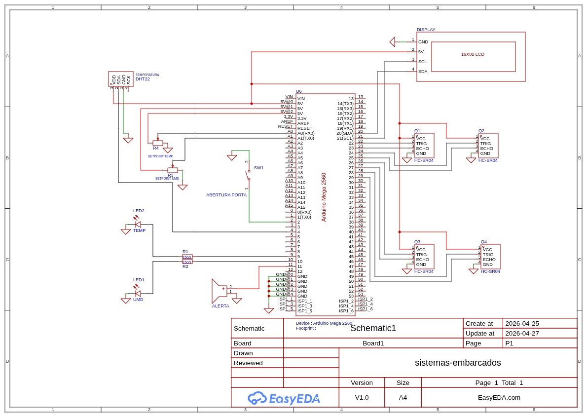
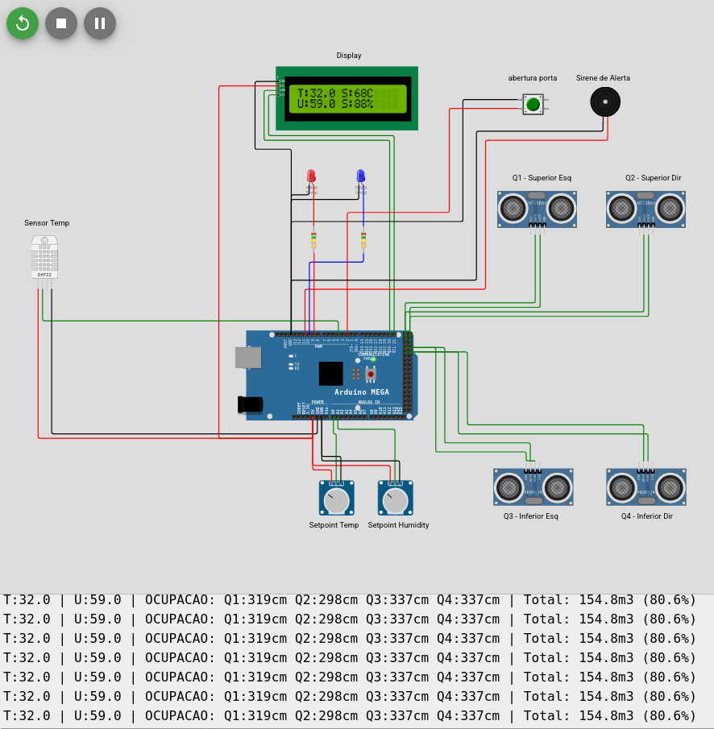

# Sistemas Embarcados - AVR Bare-metal Programming

Este repositório compila as atividades práticas e o projeto final desenvolvidos na disciplina de **Sistemas Embarcados** na UFRN. O foco central reside na programação de baixo nível para a arquitetura AVR (**ATmega328P** e **ATmega2560**), priorizando a manipulação direta de registradores e a gestão de periféricos internos sem o uso de abstrações de alto nível (Arduino API).

---

## Tecnologias e Ferramentas

*   **Linguagens:** `C (AVR-GCC)`, `C++ (Arduino IDE)` e `LaTeX`.
*   **Hardware:** ATmega328P (Uno), ATmega2560 (Mega).
*   **Simulação:** Tinkercad e Wokwi.
*   **Documentação:** Overleaf (LaTeX).

---

## Projeto Final: SGC2AE
O **Sistema de Gestão e Controle Automatizado de Estoque (SGC2AE)** é uma solução de *Edge Computing* para monitoramento e segurança de depósitos.

### Principais Funcionalidades:
*   **Gestão de Inventário:** Monitoramento volumétrico em 4 quadrantes via sensores ultrassônicos.
*   **Controle Ambiental:** Monitoramento de temperatura/umidade (DHT22) com exaustores automatizados via PWM.
*   **Segurança Patrimonial:** Detecção de intrusão via Interrupções de Hardware (Sensor de porta) e alerta sonoro.
*   **Interface HMI:** Display LCD 16x2 I2C para telemetria local e monitoramento serial.

#### Visão do Projeto:
| Esquema Elétrico | Montagem no Protoboard |
| :---: | :---: |
|  |  |

---

## Especificações Técnicas
*   **Target Hardware:** ATmega328P (8-bit AVR RISC architecture).
*   **Clock Frequency:** 16 MHz (External Crystal Oscillator).
*   **Toolchain:** AVR-GCC compiler, Toolchain AVR.
*   **Paradigma:** Bare-metal programming (eficiência de ciclos de clock e gestão de memória Flash/SRAM).

---

## Conceitos de Baixo Nível Aplicados
Conforme as diretrizes da disciplina, é **proibido** o uso de funções da API Arduino (como `digitalWrite` ou `delay`). Foram implementados:

### 1. Manipulação de I/O Digital via Registradores
Substituição das funções `pinMode()` e `digitalWrite()` pela configuração direta:
*   **DDRx (Data Direction Register):** Definição de direção de fluxo (Entrada/Saída).
*   **PORTx (Data Register):** Controle de estados lógicos e ativação de resistores de pull-up.
*   **PINx (Input Pins Address):** Leitura síncrona de estados de entrada.

### 2. Gestão de Temporização por Hardware (Timers/Counters)
Uso do **Timer 1 (16-bit)** para bases de tempo precisas, evitando o bloqueio da CPU:
*   **Prescaling:** Divisão de frequência (64, 256 ou 1024) para resoluções de milissegundos.
*   **Modo CTC (Clear Timer on Compare Match):** Utilização do registro `OCR1A` para alvos determinísticos.
*   **PWM:** Geração de sinais via registros `TCCRnA/B` para controle proporcional.

### 3. Conversão Analógica-Digital (ADC)
Manipulação direta para amostragem de sensores:
*   **ADMUX:** Seleção de canal e referência de tensão.
*   **ADCSRA:** Controle de habilitação, prescaler e início de conversão.

### 4. Interrupções Externas
Gerenciamento de eventos assíncronos em tempo real:
*   **EICRA & EIMSK:** Configuração de sentido de borda (Rising/Falling) e máscaras de interrupção.

---

## Atividades Desenvolvidas

| Aula | Descrição da Atividade | Código | Esquema | Montagem |
| :--- | :--- | :---: | :---: | :---: |
| **05** | Fundamentos de I/O e Lógica (Blink Rápido/Lento) | [📄](./atividades/aula_5_atv_01) | [🖼️](./figuras/aula_5_atv_01/atv01_esquematico.png) | [🔌](./figuras/aula_5_atv_01/atv01_montagem.png) |
| **05** | Estruturas Condicionais e Temporização | [📄](./atividades/aula_5_atv_02) | [🖼️](./figuras/aula_5_atv_02/atv02_esquematico.png) | [🔌](./figuras/aula_5_atv_02/atv02_montagem.png) |
| **05** | Laços de Repetição e Modularização | [📄](./atividades/aula_5_atv_03) | [🖼️](./figuras/aula_5_atv_03/atv03_esquematico.png) | [🔌](./figuras/aula_5_atv_03/atv03_montagem.png) |
| **05** | Funções Customizadas e Manipulação de Portas | [📄](./atividades/aula_5_atv_04) | [🖼️](./figuras/aula_5_atv_04/atv04_esquematico.png) | [🔌](./figuras/aula_5_atv_04/atv04_montagem.png) |
| **06** | Controle de LED com Frequência Variável | [📄](./atividades/aula_6_atv_01) | [🖼️](./figuras/aula_6_atv_01/atv01_esquematico.png) | [🔌](./figuras/aula_6_atv_01/atv01_montagem.png) |
| **06** | **Semáforo:** Lógica de Estados em Ciclo Contínuo | [📄](./atividades/aula_6_atv_02) | [🖼️](./figuras/aula_6_atv_02/atv02_esquematico.png) | [🔌](./figuras/aula_6_atv_02/atv02_montagem.png) |
| **07** | **ADC:** Leitura de Potenciômetro e Serial Monitor | [📄](./atividades/aula_7_atv_01) | [🖼️](./figuras/aula_7_atv_01/atv01_esquematico.png) | [🔌](./figuras/aula_7_atv_01/atv01_montagem.png) |
| **07** | **ADC:** Controle de LED e Estimativa de Corrente | [📄](./atividades/aula_7_atv_02) | [🖼️](./figuras/aula_7_atv_02/atv02_esquematico.png) | [🔌](./figuras/aula_7_atv_02/atv02_montagem.png) |
| **08** | **Interrupção:** Contador Binário (Pino 2) | [📄](./atividades/aula_8_atv_01) | [🖼️](./figuras/aula_8_atv_01/atv01_esquematico.png) | [🔌](./figuras/aula_8_atv_01/atv01_montagem.png) |
| **08** | **Semáforo com Pedestre:** Gerenciamento de Estados | [📄](./atividades/aula_8_atv_02) | [🖼️](./figuras/aula_8_atv_02/atv02_esquematico.png) | [🔌](./figuras/aula_8_atv_02/atv02_montagem.png) |
| **09** | **PWM:** Controle de Velocidade e Brilho | [📄](./atividades/aula_9_atv_01) | [🖼️](./figuras/aula_9_atv_01/atv01_esquematico.png) | [🔌](./figuras/aula_9_atv_01/atv01_montagem.png) |
| **10** | **Serial:** Controle Proporcional via UART | [📄](./atividades/aula_10_atv_01) | [🖼️](./figuras/aula_10_atv_01/atv01_esquematico.png) | [🔌](./figuras/aula_10_atv_01/atv01_montagem.png) |

---

## Estrutura do Repositório
*   **`/atividades`**: Códigos-fonte `.ino` comentados com uso de `DDRx`, `PORTx`, `ADMUX`, etc.
*   **`/projeto_final`**: Código, diagramas e imagens do sistema SGC2AE.
*   **`/relatorio`**: Documentação técnica final em PDF (`relatorio_sist_embarcados.pdf`).
*   **`/figuras`**: Acervo de esquemáticos e fotos de montagem das atividades.

---

## Desenvolvedores
*   **Arleswasb** - Desenvolvedor
*   **OliveiraLuis33** - Desenvolvedor
*   **Lucasadasc** - Desenvolvedor
*   **EugenioVLopes** - Desenvolvedor
*   **MuriloBarros304** - Desenvolvedor

**Docente:** Prof. Dr. Tales Câmara

---
> Projeto desenvolvido para a disciplina DCA3706 - Sistemas Embarcados (UFRN).
